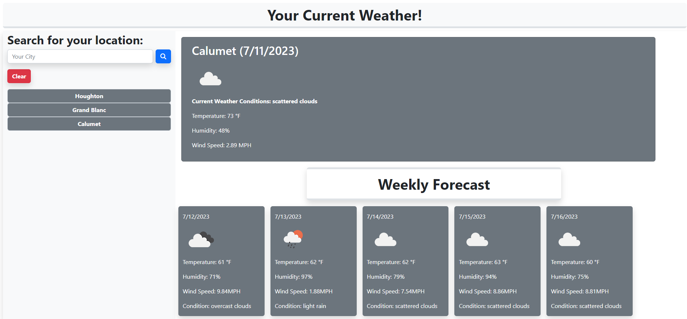

# Current-Weather-App

## Description

- This application is meant to assist you in researching current and future weather conditions.
- It allows you to look up multiple locations in a single session.
- You can check updated weather conditions on previous searches easily.

## Link to Live Application

https://mhammy.github.io/current-weather-app/

## Usage

Type the city in the search bar you'd like to see current and upcoming weather for.
Your search input will be saved to localStorage and displayed below the search bar.
Upon returning to the application, you can use the search history to quickly display previous search entries.
To clear your search, use the "clear" button.

## Credits

With the help of a few (noted below) sources, I am the original creator of the code used in this application.

---

chatGPT for syntax error resolution ideas.

r/webdev

https://openweathermap.org/api

https://getbootstrap.com

https://fontawesome.com/docs/apis/

---

## License

Please refer to the License in the repository.